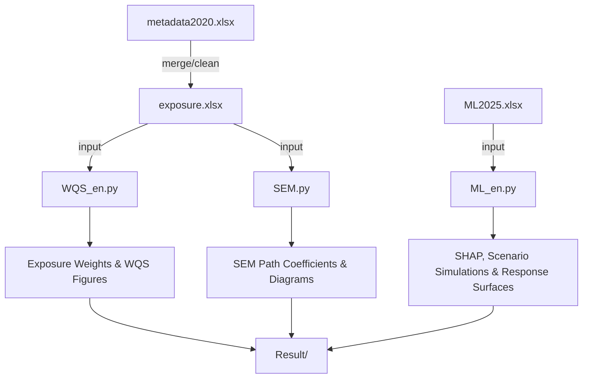

This repository provides a **reproducible analytical pipeline** for evaluating multi-pathway cadmium (Cd) exposure and its health implications using three complementary approaches:

1. **Weighted Quantile Sum (WQS) regression** — quantifies the combined effect and relative importance of multiple exposure pathways.  
2. **Structural Equation Modeling (SEM)** — identifies direct and indirect causal pathways among environmental media and human biomarkers.  
3. **Machine Learning (ML)** — models nonlinear associations, explains variable importance (via SHAP), and simulates exposure reduction scenarios.


## **Project Structure**

```
project_root/
├── data/
│   ├── metadata2020.xlsx         # Raw demographic and participant metadata
│   ├── exposure.xlsx             # Exposure dose calculation results (main input for WQS & SEM)
│   ├── ML2025.xlsx               # Machine learning dataset (processed features & outcomes)
│
├── code/
│   ├── WQS_en.py                 # Weighted Quantile Sum regression & visualization
│   ├── SEM.py                    # Structural Equation Modeling (path analysis)
│   ├── ML_en.py                  # ML models (XGB, RF, LGBM), SHAP, and scenario simulations
│
└── Result/
    ├── *.xlsx / *.csv            # Model outputs & summary metrics
    ├── *.tiff / *.pdf / *.png    # Publication-quality figures
```

---

## **Workflow Diagram**



---

## **Data Description**

| File | Description | Main Usage |
|------|--------------|------------|
| **metadata2020.xlsx** | Raw demographic data (age, gender, BMI, occupation, distance from source) | Contextual metadata |
| **exposure.xlsx** | Exposure dose calculations for soil, water, diet pathways | Input for WQS & SEM |
| **ML2025.xlsx** | Processed feature-target dataset | Input for ML models |

**Exposure pathways include:**  
`Soil_ingestion`, `Water_ingestion`, `Water_dermal`, `Diet_rice`, `Diet_solanaceous`, `Diet_legumes`, `Diet_root_tuber`, `Diet_other`  
Aggregates (`Diet_total`, `Env_total_calc`) are computed internally.

---

## **Code Overview**

### **1. WQS_en.py**
- Weighted Quantile Sum regression to estimate mixture effects.  
- Computes exposure weights and pathway contributions.  
- Tests nonlinearity using quadratic WQS term.

**Outputs**
- `WQS_Analysis_Results.xlsx` (weights, coefficients, p-values)  
- `Fig1_WQS_Weights.(tiff|pdf)` — Exposure pathway importance  
- `Fig2_WQS_vs_Urinary_Cd.(tiff|pdf)` — WQS index vs urinary Cd  

---

### **2. SEM.py**
- Structural Equation Modeling for direct/indirect effects among soil Cd, rice Cd, and urinary Cd.  
- Provides model fit indices and path diagrams.

**Outputs**
- Standardized path coefficients  
- Goodness-of-fit metrics (χ², RMSEA, CFI, SRMR)  
- SEM pathway diagram (publication-ready)

---

### **3. ML_en.py**
- Trains **XGBoost**, **Random Forest**, and **LightGBM** models.  
- Computes evaluation metrics (R², RMSE, MAE).  
- Visualizes **SHAP beeswarm** (full data, triptych).  
- Performs **RF-based scenario simulations** (e.g., rice Cd caps, diet diversification, soil mitigation).  
- Generates **response curves** and **2D/3D surfaces** for exposure reductions.

**Outputs**
- `SHAP_beeswarm_all_3models_reversed.(png|pdf)`  
- `RF_Scenario_DeltaGM_and_GM_split_CI_v4.(png|pdf)`  
- `Curve_UrineCd_vs_Reduction_GM.(png|pdf)`  
- `Surface_UrineCd_GM_vs_DietEnv.(png|pdf)`  
- `Surface3D_UrineCd_GM_vs_DietEnv.(png|pdf)`  

---

## **Environment and Dependencies**

Python ≥ 3.9 is recommended.  
Install all dependencies:

```bash
pip install numpy pandas scikit-learn xgboost lightgbm shap statsmodels matplotlib seaborn openpyxl
```

---

## **Execution**

1. Place `.xlsx` datasets under the `/data/` directory.  
2. Update file paths in scripts if necessary (variable `FILE = ...`).  
3. Run the analyses:

```bash
python code/WQS_en.py
python code/SEM.py
python code/ML_en.py
```

4. Results and figures will be saved automatically under `/Result/`.

---

## **Reproducibility**

- Fixed random seeds ensure deterministic splits.  
- Bootstrapping (default 500 iterations) for confidence intervals.  
- Consistent data transformation (`log1p`) across models.  
